<h1 align=center>Welcome to Mötör-Werks Portfolio Project 5</h1>

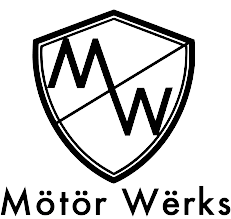 
Mötör-Werks is a mobile vehicle repairs and servicing e commerce website. 
Take the stress out of vehicle servicing and repairs with our simple revolutionary 5 tier system.

 
<h1 align=center></h1>

## FINAL DESIGN
 
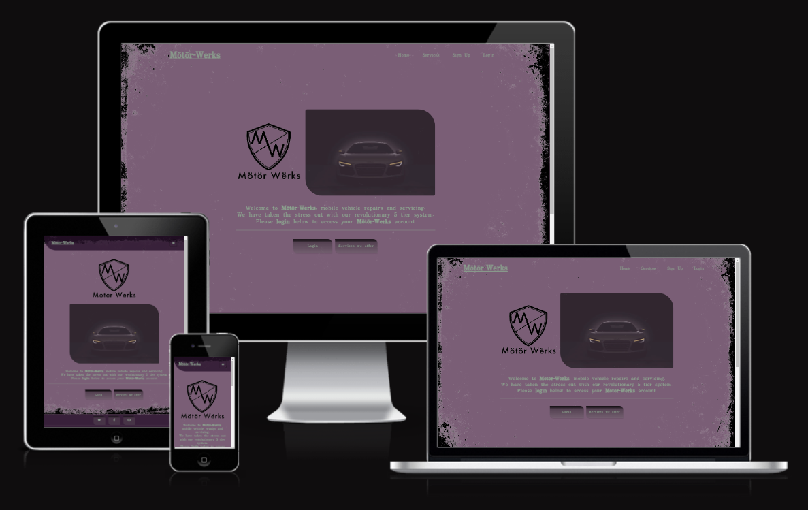

#
[Here is a link to the final project](https://motor-werks.herokuapp.com/)
#

## User Experience

### User Stories

1. As a user, I would like to be able to:

    1.1 Register on the website using my username, email address and password `(MUST HAVE)`

    1.2 View all services available on the site `(SHOULD HAVE)`

    1.3 View details about all services `(SHOULD HAVE)`

    1.4 Receive a confirmation email after registering `(MUST HAVE)`

2. As a logged in user, I would like to be able to:

    2.1 Have a personalised profile that displays my vehicle information `(SHOULD HAVE)`

    2.2 Choose a new service `(SHOULD HAVE)`

    2.3 Easily pay for my chosen service `(MUST HAVE)`

    2.4 Edit or delete my personal profile `(SHOULD HAVE)`
#
### 1. Strategy

  + **Project Goal**

   Create a platform that allows people (users) to Login and purchase (via [Stripe.com](https://stripe.com/gb)) a Service or Repair for their vehicle.

### 2. Scope

 * A simple, straightforward, intuitive UX experience
 * An explicit content
 * An easy navigation for the user through all of the features
 * A site that is visually appealing on most devices

## Functional Scope

**Motor-werks Flowchart**

Flowchart

 

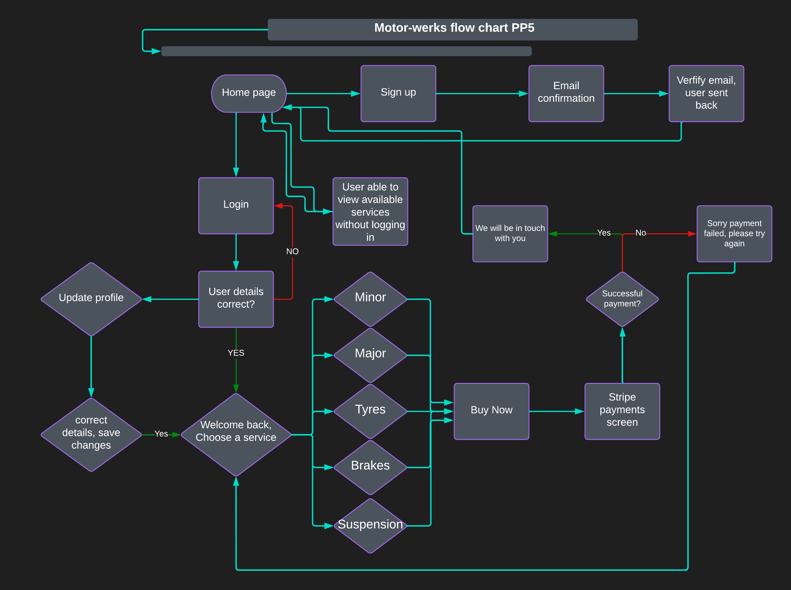

 

**Motor-werks Entity Relationship Diagram (ERD)**

Database Schema

 

 

**Agile Methodology**

All functionality and development of this project were managed using **Trello** (https://trello.com/b/Ha79yDqn/motor-werks-pp5)

* Credentials to this tool will be provided during submission

### 3. Structure

* A clear and straightforward layout is in place to ensure users can navigate intuitively and have a leisurely experience
* Navbar is fixed on top to facilitate users to navigate through pages easily
* A Small dropdown menu navigation is the same on all pages at small screen sizes to ensure easy navigation
* Create account, Edit/Update profiles are straight forward forms to allow users to use the features without issues

### 4. Skeleton

* Wireframes created with Balsamiq.  
* The project was developed from initial wireframes, and some modifications were made during the development process in response to user feedback

Click to see wireframes:

 

[Home](static/assets/images/README-images/wireframes/Desktop-Home.png)  
[Services](static/assets/images/README-images/wireframes/Desktop-services.png)  
[Single service](static/assets/images/README-images/wireframes/Desktop-individual-service.png)  
[Register](static/assets/images/README-images/wireframes/Desktop-signup.png)  
[Login](static/assets/images/README-images/wireframes/Desktop-login.png)  
[Home mobile](static/assets/images/README-images/wireframes/Mobile-home.png)  
[Services mobile](static/assets/images/README-images/wireframes/Mobile-services.png)  
[Single service mobile](static/assets/images/README-images/wireframes/Mobile-individual-services.png)  
[Register mobile](static/assets/images/README-images/wireframes/Mobile-Signup.png)  
[Login mobile](static/assets/images/README-images/wireframes/Mobile-Login.png)  

 

### 5. Surface

* Colours

- I used [Coolors](https://coolors.co/) to randomly generate a colour palette for this project. 
I went bold and arguably opposite colours for this project.
The main colours are Light and dark purple with light green accents and text.

Click to see Colours:

 

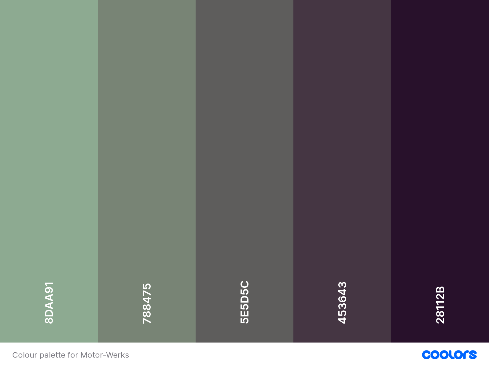 

 

**Font Selection**
 
Two fonts were chosen with [Google Fonts](https://fonts.google.com/) to be used across the entire site.

The chosen fonts were 'Uchen', with serif as back up fonts for lists, forms, buttons and paragraphs.

Click to see Font style:

 

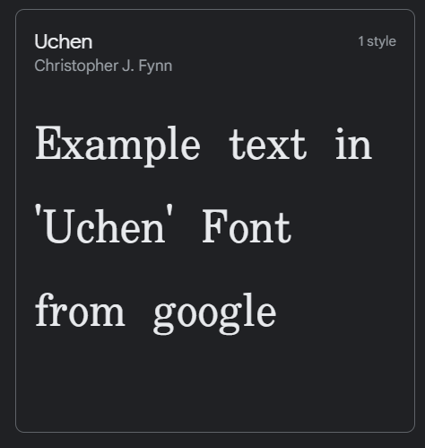 

 

## Social Media Marketing

  * For the purposes of the assessment a mock Facebook page was created to represent the company on a social media platform. 
   - The Facebook page includes links to the Motor-werks website to drive traffic from the social network to the site. 
   

  
Social media buisness page

   

  .png)
   
  .png)
   
  .png)
   
  .png)
   
  .png)
   
  .png)
  

   

#
## Existing Features
### **Home page**

1. Home page consists of: 
 - A welcome message (alternative message if user is logged in, see images below)
 - The purpose of the site
 - Two images, 
    * One motor-werks logo
    * One image of an audi R8 in the dark with lights on (Removed on smaller screen sizes)
- A button to login if user is logged out or has yet to sign up along with a button to view services
- A button to view services if the user is logged in
 

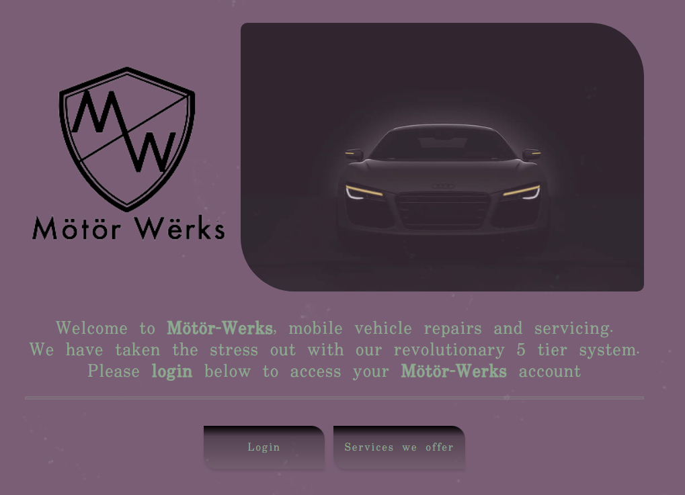
 
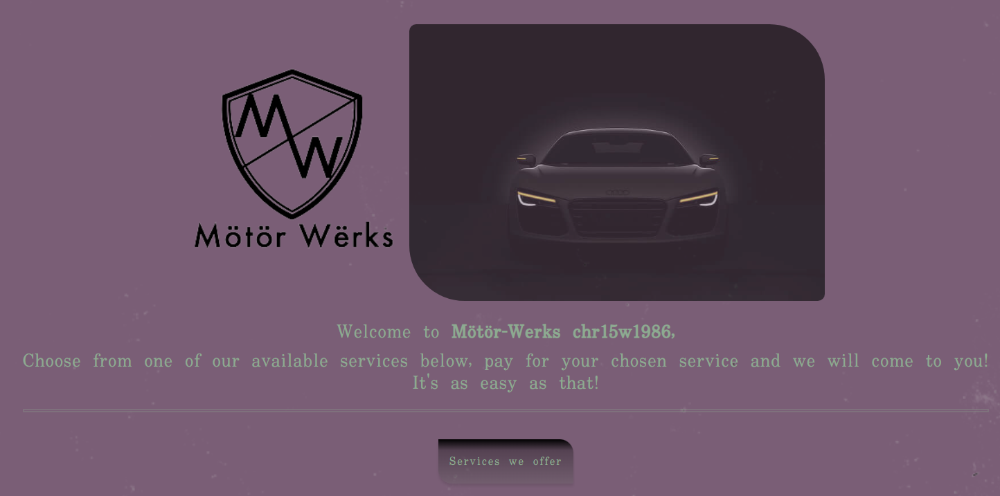

### **Navbar**

+ Fixed Navbar to allow the user easy access to all pages

1. Home, Services, Signup and Login buttons on the navbar are the only buttons present if the user is `not` logged in

  

2. Home, Services, {username}'s profile and Logout buttons are only present if the user has successfully logged in

  

3. Services is available to view for all users (logged in or not), however, the services page is read-only until 
the user logs in, or signs up

4. Collapsed navbar on smaller devices to wrap in all options and assure better navbar design.
  - Rounded bottom left edge is part of the site-wide design 

  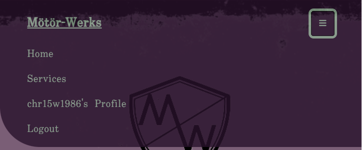

### **Services page**

1. On this page, users can view all available services
  - If the user is not logged in, a login button will be available
  - If the user is logged in, a GO BACK button will be available
 

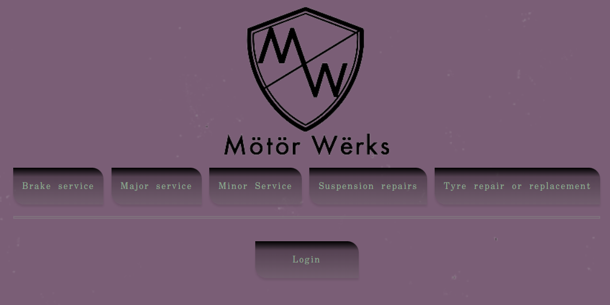
 
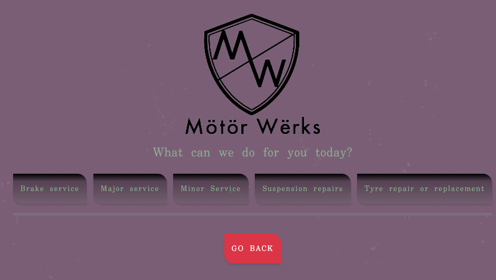

* Each button will take the user to the relevant service they wish to view which are,
  - `Brake service`
  - `Major Service`
  - `Minor Service`
  - `Suspension repairs`
  - `Tyre repair or replacement`
 

  
* Upon the user pressing a button, they will be taken to the `service-detail` page for the chosen service,
  - Once again, if the user is logged in, a button `Buy Now` will appear within the detail card
  - If the user is not logged in, the card is read-only with a request 'Please login in to purchase this service' and a login button
 
  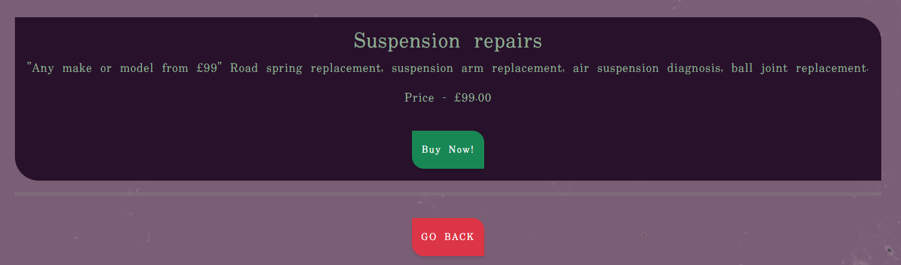
  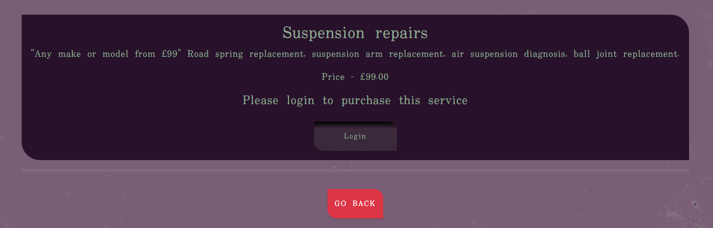
 

### **Payments (STRIPE)**

* After the `logged in` user has the clicked `Buy Now!` button on the service detail page,
 
  the user is taken to a `Please confirm if you wish to continue with your purchase` page.

  * The user is then taken directly to the [Stripe.com](https://stripe.com/gb) payment window.
   - Due to the nature of this project, only test payments are available.
   - Payment information is:
      - `4242 4242 4242 4242` (card number)
      - `04/24` (MM/YY)
      - `424 or 242` (CVC)
      - `Any name`
      - `Any postcode`
   
    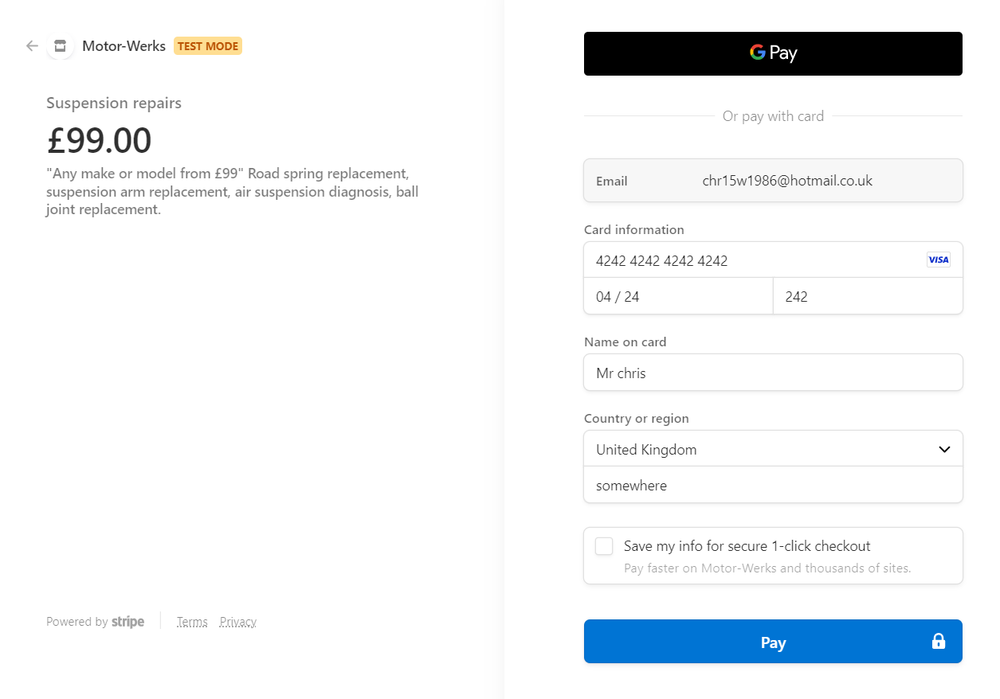
   
  * After entering the information above and clicking `Pay`, 
    the user is returned back to the site, to a payment confirmation page
   
    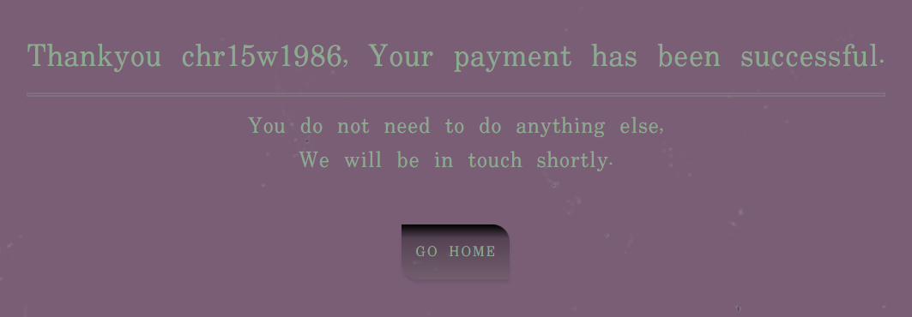
   
  * If, however, the payment failed, or the payment cancelled, 
    the user is returned back to the site, to a payment cancelled page
   
    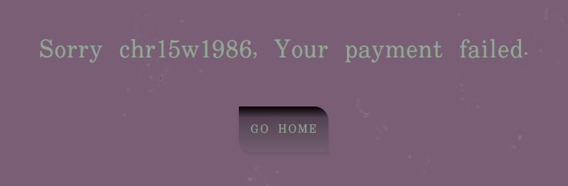
   

### **Profile page (with CRUD)** 

* Here the user is able to read, update and delete their own profile, including:
  * `first name`
  * `last name`
  * `email`
  * `vehicle reg`
  * `street address1`
  * `street address2`
  * `town or city`
  * `county`
  * `postcode`
  * `phone number`
 

  1.1. With validation, only the logged in user can view this page
   

 
   i. For Edit profile, a custom modal pops up which contains a fully editable form,  where the user can change details   
    
    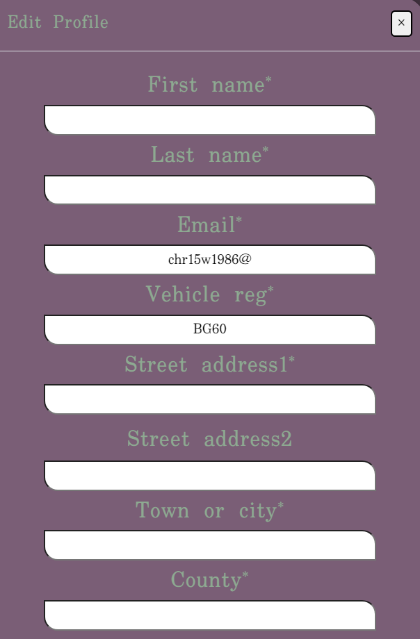
     
    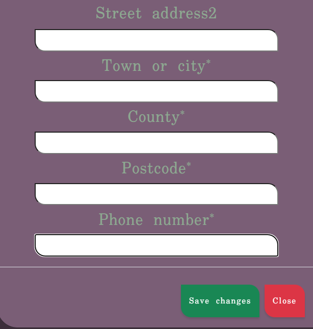
     
  
  1.2. Delete profile, will take the user to a confirmation page
    
    
     
  1.3. At the confirmation page, the cancel button will return the user to `Home` with no effect to the database
    
  1.4. But if the user wishes to delete their profile, all data is removed after confirmation and the user is sent back to a `delete-success` page where the user has 3 choices, `Login`, `Signup` or `Services we offer`
     
    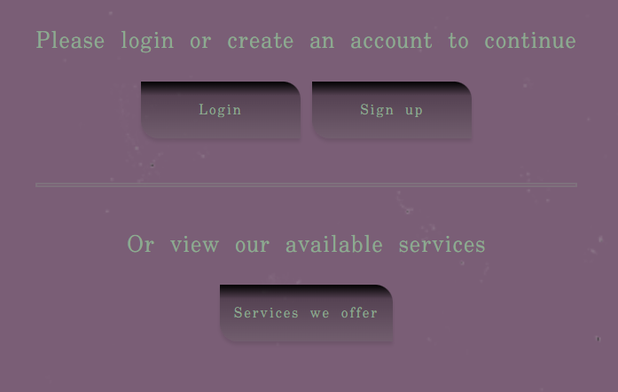
     
  1.4.1. If the user attempts to log back in with the recently deleted information, `The e-mail address and/or password you specified are not correct` message will appear. The user must signup again.

### **Custom 500 Internal server error**

* I have created a custom 500 error page to redirect to if there are any issues with the database including a button to redirect back to home

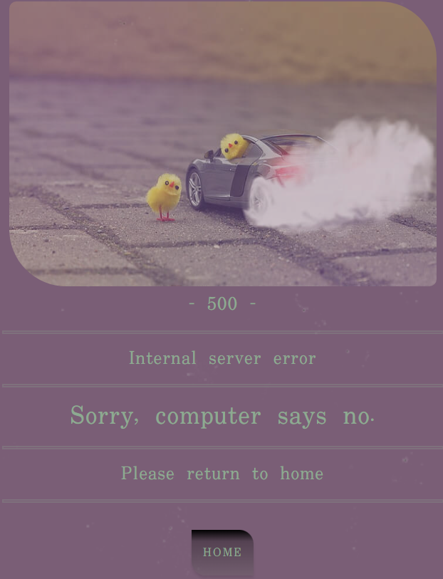

### **Custom 404 Page not found**

* I have created a custom 404 error page to catch if the user inputs the wrong page number, or if a page or feature does not exist
* I have included a button to redirect back to home

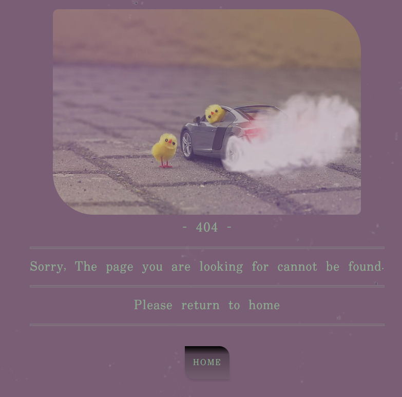

### **Custom 403 Forbidden page**

* I have created a custom 403 forbidden error page to redirect to if there are any instances where a user tries to access a secure area of the site (e.g admin), including a button to redirect back to home

### **Custom 405 Method not allowed page**

* I have also created a custom 405 method not allowed error page to redirect to if there are any instances where the server knows the request method, but the target resource doesn't support the method, including a button to redirect back to home
#
## Future Features

I would like to...

1. Add an option for the user to purchase more than one service e.g with a basket or checkout system
2. Add an online chat service to hone in on the specifics the customer needs e.g If the user purchased tyres, they could talk to me about brands or sizes
3. Include a comments or ratings section that all users can view, that could be linked to the service they purchased

#
## Languages Used

## Frameworks, Libraries, Programs and Technologies Used

+ Django 3.2: Framework used to add structure to the platform
+ Django AllAuth used to provide enhanced user account functionality
+ Django templating language used to insert data from the database into the sites pages
+ Bootstrap: Framework used to add structure and responsiveness
+ Favicon Generator: Used to create favicon used on the website
+ GitHub: GitHub respository is used to store the project's code after being pushed from Gitpod
+ Google Fonts: Google fonts are used to add fonts for aesthetic and UX purposes
+ Balsamiq: Balsamiq was used to create the wireframes during the design process
+ Git: Gitpod IDE was used for version control by utilizing the Gitpod terminal to commit and Push to GitHub
+ Grammarly: Used to correct any spelling mistakes on readme and app text
+ AmIResponsive: Used to generate mockup image

* Python modules installed:
   - asgiref==3.5.2
   - boto3==1.24.46
   - botocore==1.27.46
   - dj-database-url==1.0.0
   - Django==3.2.13
   - django-allauth==0.51.0
   - django-crispy-forms==1.14.0
   - django-lint==2.0.4
   - django-storages==1.13.1
   - gunicorn==20.1.0
   - jmespath==1.0.1
   - logilab-astng==0.24.3
   - logilab-common==1.9.7
   - oauthlib==3.2.0
   - psycopg2==2.9.3
   - psycopg2-binary==2.9.3
   - PyJWT==2.4.0
   - pylint==0.28.0
   - python3-openid==3.2.0
   - pytz==2022.1
   - requests-oauthlib==1.3.1
   - s3transfer==0.6.0
   - sqlparse==0.4.2
   - stripe==2.63.0

## Testing and Code validation
<!-- TO DO -->
All testing and code validation details are described in a separate file [TESTING.md](TESTING.md)

## Deployment

Motor-werks is deployed using Heroku

Heroku Deployment steps: 

 1. Ensure all dependencies are listed within the requirements.txt file

 Within the terminal in Gitpod type `pip3 --local freeze > requirements.txt`, and a list with all requirements will be created to be read by Heroku.

 2. Setting up Heroku
      
    2.1 Navigate to the [Heroku](https://www.heroku.com/) website

    2.2 Login to Heroku
    
    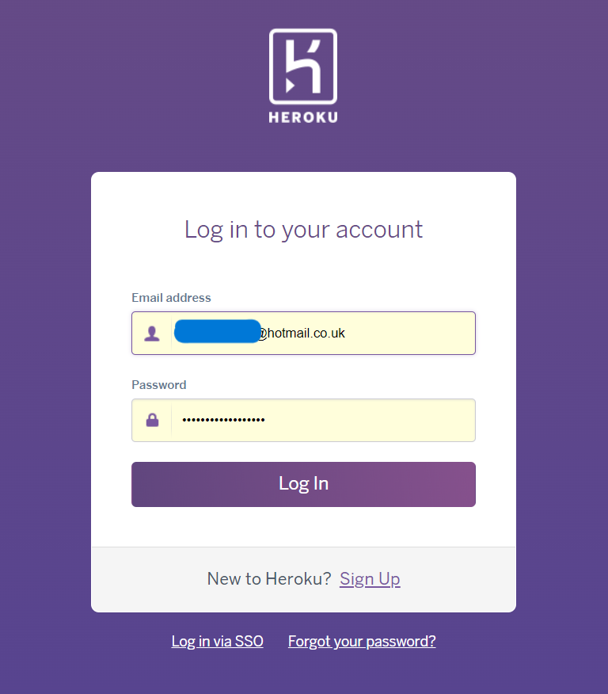

    2.3 Click on `New` (top right) and Create a new app
    
    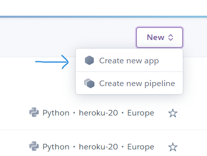
    
    2.4 Choose a project name and set your location
    
    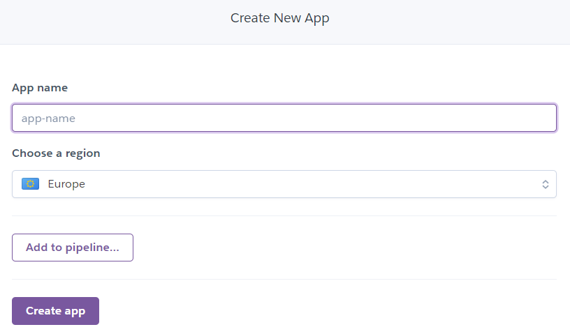

    2.5. Navigate to the `Resources` tab

    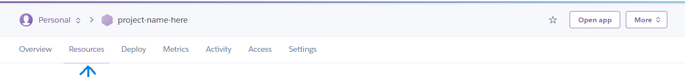

    2.6. In the `Add ons` section, search for Heroku Postgres and select it on the list
      - A pop up will appear, select, 'Hobby Dev' and click `Submit order form`
    
    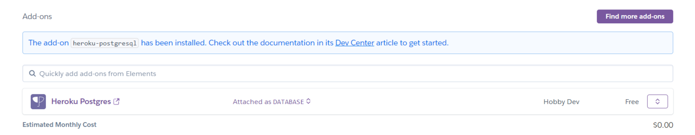
    
    2.7. Next, navigate to the `deploy` tab;
      - Click on connect to Github
      - Search for the repository named `Motor-werks`
      - And connect heroku to Github. 
        
    2.8. Navigate to the settings tab
    
    2.9.  Click on Config Vars, add Database URL (from Heroku-Postgres) and Secret key,
      - Add relevent secret keys and environment variables

 

Forking the GitHub Repository 

* By forking the GitHub Repository, you will be able to make a copy of the original repository on your own GitHub account, allowing you to view and/or make changes without affecting the original repository by using the following steps:

    - Log in to your own GitHub and locate the GitHub Repository you wish to fork
    - At the top of the Repository (not top of page), just above the "Settings" button on the menu, locate the "Fork" button.
    - You should now have a copy of the original repository in your GitHub account

* Making a Local Clone

    - Log in to your own GitHub and locate the GitHub Repository
    - Under the repository name, click "Clone or download"
    - To clone the repository using HTTPS, under "Clone with HTTPS", copy the link
    - Open Git Bash
    - Change the current working directory to the location where you want the cloned directory to be made
    - Type git clone, and then paste the URL you copied in Step 3

 $ git clone https://github.com/Chr15w1986/Motor-Werks

Press Enter. Your local clone will be created

 

AWS S3 (Amazon web services storage)

  1. Navigate in a browser to Amazon AWS, log in, or create an account
  2. Create a new S3 bucket for the site and create a static directory and media directory within the bucket
  3. From the dashboard - copy the bucket details into the settings.py file: 
    - you will require the following: 
    - Storage Bucket Name 
    - Storage Bucket Region Name 
    - Access Key ID 
    - Secret Access Key 
  4. Add these settings to the env.py file to link AWS: 
    - os.environ["AWS_ACCESS_KEY_ID"] = `'your access key'` 
    - os.environ["AWS_SECRET_ACCESS_KEY"] = `'your secret access key'` 
  5. Back in Heroku, add the keys and values from AWS and env.py to the config vars

 

Stripe payments Setup

 * This project uses Stripe as a payment provider - 
  1. Create a stripe account at stripe.com 
  2. Make sure you click `developer` account to gain access to the api keys required to run the payment processes
  3. Once you have successfully created your stripe account: 
      - Copy the stripe public key, stripe secret key and stripe webhook key into your env.py file and into heroku config vars 
      - Configure the settings file to find the variables required by stripe 
      - `STRIPE_PUBLISHABLE_KEY = os.environ.get('STRIPE_PUBLISHABLE_KEY')` 
      - `STRIPE_SECRET_KEY = os.environ.get('STRIPE_SECRET_KEY')` 
      - `STRIPE_ENDPOINT_SECRET = os.environ.get('STRIPE_ENDPOINT_SECRET')` 
      - `DOMAIN_URL = os.environ.get('DOMAIN_URL')` 

 

#
## Credits and references

### Images

* All images have been compressed using [tinypng.com](https://tinypng.com/)

* Main home screen image of an audi R8 in the dark, [wallpaperflare.com](https://www.wallpaperflare.com/audi-r8-v8-2014-audi-r8-coupe-car-wallpaper-bhfta)
* Image of two chicks doing a burnout in a toy R8 for the error handler pages (bit of comedy.), [wallpaperflare.com](https://www.wallpaperflare.com/cars-chickens-chicks-chickens-audi-r8-burnout-sports-cars-audi-r8-v8-technology-vehicles-hd-art-wallpaper-sfbhn)
* Motor-werks logo, [squarespace.com](https://static1.squarespace.com/static/5d3f253d3bb01d0001087e06/t/5d3f2734701cda00012936e4/1644943519357/)
* Tool to remove the Motor-werks background to create transparent logo, [remove.bg](https://www.remove.bg/)
* Background image of scratched/worn (border/surround), [pngwing.com](https://www.pngwing.com/en/free-png-bzkyg)

## Acknowledgements

- Code institute for the amazing Tutors on the course, Scott, Ger and Sean!
- My brilliant Mentor Ben Kavanagh, [BAK2K3](https://github.com/BAK2K3) for his patience, excellent advice on my code, pushing me back on track
    when I threatened to 'throw in the towel', taking time out of his own day and duties to answer ALL of my questions with absolute perfection, and just generally being a Python God! I cannot thank you enough!
- Matt Bodden [MattBCoding](https://github.com/MattBCoding), Yet again for being an absolute genius at pointing out the obvious.
Thanks Matt!
- My family for their support, patience and testing
- My wonderful Wife for being my personal spell checker/grammar police and for listening to me when I needed to blow off steam!
- Everybody on Slack for tips, advice, quick fixes and support

<!-- ISSUES -->
white on white text apple iphone 11pro, XR and 13, fixed by setting text input colour to #000 black