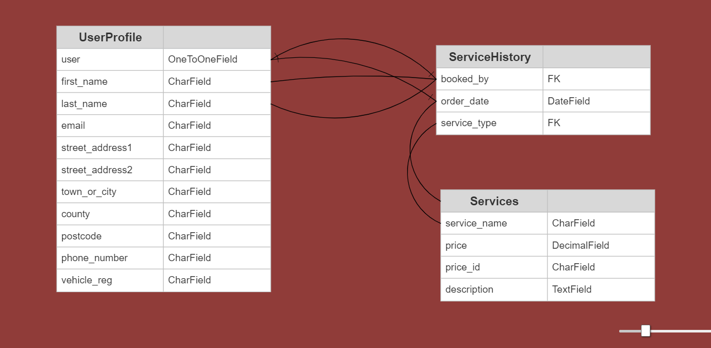

<h1 align=center>Welcome to Mötör-Werks Portfolio Project 5</h1>

 
Mötör-Werks is a mobile vehicle repairs and servicing e commerce website. 
Take the stress out of vehicle servicing and repairs with our simple revolutionary 5 tier system.

 
<h1 align=center></h1>

## FINAL DESIGN
 

#
[Here is a link to the final project](https://motor-werks.herokuapp.com/)
#

## User Experience

### User Stories

1. As a user, I would like to be able to:

    1.1 Register on the website using my username, email address and password `(MUST HAVE)`

    1.2 View all services available on the site `(SHOULD HAVE)`

    1.3 View details about all services `(SHOULD HAVE)`

    1.4 Receive a confirmation email after registering `(MUST HAVE)`

2. As a logged in user, I would like to be able to:

    2.1 Have a personalised profile that displays my vehicle information `(SHOULD HAVE)`

    2.2 Choose a new service `(SHOULD HAVE)`

    2.3 Easily pay for my chosen service `(MUST HAVE)`

    2.4 Edit or delete my personal profile `(SHOULD HAVE)`
#
### 1. Strategy

  + **Project Goal**

   Create a platform that allows people (users) to Login and purchase (via [Stripe.com](https://stripe.com/gb)) a Service or Repair for their vehicle.

### 2. Scope

 * A simple, straightforward, intuitive UX experience
 * An explicit content
 * An easy navigation for the user through all of the features
 * A site that is visually appealing on most devices

## Functional Scope

**Motor-werks Flowchart**

Flowchart

 

 

**Motor-werks Entity Relationship Diagram (ERD)**

Database Schema

 

 

**Agile Methodology**

All functionality and development of this project were managed using **Trello** (https://trello.com/b/Ha79yDqn/motor-werks-pp5)

* Credentials to this tool will be provided during submission

### 3. Structure

* A clear and straightforward layout is in place to ensure users can navigate intuitively and have a leisurely experience
* Navbar is fixed on top to facilitate users to navigate through pages easily
* A Small dropdown menu navigation is the same on all pages at small screen sizes to ensure easy navigation
* Create account, Edit/Update profiles are straight forward forms to allow users to use the features without issues

### 4. Skeleton

* Wireframes created with Balsamiq.  
* The project was developed from initial wireframes, and some modifications were made during the development process in response to user feedback

Click to see wireframes:

 

[Home](static/assets/images/README-images/wireframes/Desktop-Home.png)  
[Services](static/assets/images/README-images/wireframes/Desktop-services.png)  
[Single service](static/assets/images/README-images/wireframes/Desktop-individual-service.png)  
[Register](static/assets/images/README-images/wireframes/Desktop-signup.png)  
[Login](static/assets/images/README-images/wireframes/Desktop-login.png)  
[Home mobile](static/assets/images/README-images/wireframes/Mobile-home.png)  
[Services mobile](static/assets/images/README-images/wireframes/Mobile-services.png)  
[Single service mobile](static/assets/images/README-images/wireframes/Mobile-individual-services.png)  
[Register mobile](static/assets/images/README-images/wireframes/Mobile-Signup.png)  
[Login mobile](static/assets/images/README-images/wireframes/Mobile-Login.png)  

 

### 5. Surface

* Colours

- I used [Coolors](https://coolors.co/) to randomly generate a colour palette for this project. 
I went bold and arguably opposite colours for this project.
The main colours are Light and dark purple with light green accents and text.

Click to see Colours:

 

 

 

**Font Selection**
 
Two fonts were chosen with [Google Fonts](https://fonts.google.com/) to be used across the entire site.

The chosen fonts were 'Uchen', with serif as back up fonts for lists, forms, buttons and paragraphs.

Click to see Font style:

 

 

 

#
## Existing Features
### **Home page**

1. Home page consists of: 
 - A welcome message (alternative message if user is logged in, see images below)
 - The purpose of the site
 - Two images, 
    * One motor-werks logo
    * One image of an audi R8 in the dark with lights on (Removed on smaller screen sizes)
- A button to login if user is logged out or has yet to sign up along with a button to view services
- A button to view services if the user is logged in
 
 

 

### **Navbar**

+ Fixed Navbar to allow the user easy access to all pages

1. Home, Services, Signup and Login buttons on the navbar are the only buttons present if the user is `not` logged in

  

2. Home, Services, {username}'s profile and Logout buttons are only present if the user has successfully logged in

  

3. Services is available to view for all users (logged in or not), however, the services page is read-only until 
the user logs in, or signs up

4. Collapsed navbar on smaller devices to wrap in all options and assure better navbar design.
  - Rounded bottom left edge is part of the site-wide design 

  

### **Services page**

1. On this page, users can view all available services
  - If the user is not logged in, a login button will be available
  - If the user is logged in, a GO BACK button will be available
 
 

 

* Each button will take the user to the relevant service they wish to view which are,
  - `Brake service`
  - `Major Service`
  - `Minor Service`
  - `Suspension repairs`
  - `Tyre repair or replacement`
 
 
  
* Upon the user pressing a button, they will be taken to the `service-detail` page for the chosen service,
  - Once again, if the user is logged in, a button `Buy Now` will appear within the detail card
  - If the user is not logged in, the card is read-only with a request 'Please login in to purchase this service' and a login button
 
 

  
  
 

#
### **Custom 500 Internal server error**

* I have created a custom 500 error page to redirect to if there are any issues with the database including a button to redirect back to home

### **Custom 404 Page not found**

* I have created a custom 404 error page to catch if the user inputs the wrong page number, or if a page or feature does not exist
* I have included a button to redirect back to home

### **Custom 403 Forbidden page**

* I have created a custom 403 forbidden error page to redirect to if there are any instances where a user tries to access a secure area of the site (e.g admin), including a button to redirect back to home

### **Custom 405 Method not allowed page**

* I have also created a custom 405 method not allowed error page to redirect to if there are any instances where the server knows the request method, but the target resource doesn't support the method, including a button to redirect back to home
#
## Future Features

I would like to...

1. Add an option for the user to purchase more than one service e.g with a basket or checkout system
2. Add an online chat service to hone in on the specifics the customer needs e.g If the user purchased tyres, they could talk to me about brands or sizes
3. Include a comments or ratings section that all users can see that could be linked to the service they bought

#
## Languages Used

## Frameworks, Libraries & Programs Used

+ Django 3.2: Framework used to add structure to the platform
+ Bootstrap: Framework used to add structure and responsiveness
+ Favicon Generator: Used to create favicon used on the website
+ GitHub: GitHub respository is used to store the project's code after being pushed from Gitpod
+ Google Fonts: Google fonts are used to add fonts for aesthetic and UX purposes
+ Balsamiq: Balsamiq was used to create the wireframes during the design process
+ Git: Gitpod IDE was used for version control by utilizing the Gitpod terminal to commit and Push to GitHub
+ Grammarly: Used to correct any spelling mistakes on readme and app text
+ AmIResponsive: Used to generate mockup image

## Testing and Code validation
<!-- TO DO -->
All testing and code validation details are described in a separate file [TESTING.md](TESTING.md)

## Deployment

Motor-werks is deployed using Heroku

Heroku Deployment steps: 

 1. Ensure all dependencies are listed within the requirements.txt file

 Within the terminal in Gitpod type `pip3 --local freeze > requirements.txt`, and a list with all requirements will be created to be read by Heroku.

 2. Setting up Heroku
      
    2.1 Navigate to the [Heroku](https://www.heroku.com/) website

    2.2 Login to Heroku
    
    

    2.3 Click on `New` (top right) and Create a new app
    
    
    
    2.4 Choose a project name and set your location
    
    

    2.5. Navigate to the `Resources` tab

    

    2.6. In the `Add ons` section, search for Heroku Postgres and select it on the list
      - A pop up will appear, select, 'Hobby Dev' and click `Submit order form`
    
    
    
    2.7. Next, navigate to the `deploy` tab;
      - Click on connect to Github
      - Search for the repository named `Motor-werks`
      - And connect heroku to Github. 
        
    2.8. Navigate to the settings tab
    
    2.9.  Click on Config Vars, add Database URL (from Heroku-Postgres) and Secret key,
      - Add relevent secret keys and environment variables

Forking the GitHub Repository 

* By forking the GitHub Repository, you will be able to make a copy of the original repository on your own GitHub account, allowing you to view and/or make changes without affecting the original repository by using the following steps:

    - Log in to your own GitHub and locate the GitHub Repository you wish to fork
    - At the top of the Repository (not top of page), just above the "Settings" button on the menu, locate the "Fork" button.
    - You should now have a copy of the original repository in your GitHub account

* Making a Local Clone

    - Log in to your own GitHub and locate the GitHub Repository
    - Under the repository name, click "Clone or download"
    - To clone the repository using HTTPS, under "Clone with HTTPS", copy the link
    - Open Git Bash
    - Change the current working directory to the location where you want the cloned directory to be made
    - Type git clone, and then paste the URL you copied in Step 3

 $ git clone https://github.com/Chr15w1986/Motor-Werks

Press Enter. Your local clone will be created

## Credits and references

### Images

* All images have been compressed using [tinypng.com](https://tinypng.com/)

* Main home screen image of an audi R8 in the dark, [wallpaperflare.com](https://www.wallpaperflare.com/audi-r8-v8-2014-audi-r8-coupe-car-wallpaper-bhfta)
* Image of two chicks doing a burnout in a toy R8 for the error handler pages (bit of comedy.), [wallpaperflare.com](https://www.wallpaperflare.com/cars-chickens-chicks-chickens-audi-r8-burnout-sports-cars-audi-r8-v8-technology-vehicles-hd-art-wallpaper-sfbhn)
* Motor-werks logo, [squarespace.com](https://static1.squarespace.com/static/5d3f253d3bb01d0001087e06/t/5d3f2734701cda00012936e4/1644943519357/)
* Tool to remove the Motor-werks background to create transparent logo, [remove.bg](https://www.remove.bg/)
* Background image of scratched/worn (border/surround), [pngwing.com](https://www.pngwing.com/en/free-png-bzkyg)

## Acknowledgements

- Code institute for the amazing Tutors on the course, Scott, Ger and Sean!
- My brilliant Mentor Ben Kavanagh, [BAK2K3](https://github.com/BAK2K3) for his patience, excellent advice on my code, pushing me back on track
    when I threatened to 'throw in the towel', taking time out of his own day and duties to answer ALL of my questions with absolute perfection, and just generally being a Python God! I cannot thank you enough!
- Matt Bodden [MattBCoding](https://github.com/MattBCoding), Yet again for being an absolute genius at pointing out the obvious.
Thanks Matt!
- My family for their support, patience and testing
- My wonderful Wife for being my personal spell checker/grammar police and for listening to me when I needed to blow off steam!
- Everybody on Slack for tips, advice, quick fixes and support

<!-- ISSUES -->
white on white text apple iphone 11pro, XR and 13, fixed by setting text input colour to #000 black

future implementation, allow users to purchase more than 1 item at a time